# Moodle plugin « Point of View »

_Quentin Fombaron - October 20th 2020, Astor Bizard - October 11th 2021_  
_Centre des Nouvelles Pédagogies (CNP*), Univ. Grenoble Alpes - University of innovation_  

The plugin **Point of view** offers the possibility to react and give difficulty levels to activities within a Moodle course. Students know the difficulty of an activity (estimated by the teacher) thanks to color tracks. They also have the possibility to react via emojis, each representing an emotion, a feeling. It is fully customizable.

This plugin is developed by Quentin Fombaron and Astor Bizard. It is initially developped for [caseine.org](http://www.moodle.caseine.org). Do not hesitate to send your thinking and bug reports to the contact addresses below.

Contacts:
- [Quentin Fombaron](mailto:q.fombaron@outlook.fr)
- [Astor Bizard](mailto:astor.bizard@univ-grenoble-alpes.fr)
- [Caseine](mailto:contact.caseine@grenoble-inp.fr)

\* *The CNP, set up as part of the IDEX Training component, brings together the DAPI, PerForm and IDEX support teams.*  

## Table of Contents

* [Point of View as a block](#point-of-view-as-a-block)
* [Usage](#usage)
    * [Difficulty tracks](#difficulty-tracks)
    * [Reactions](#reactions)
        * [Accessing reactions details](#accessing-reactions-details)
* [Configuration](#configuration)
    * [Enabling reactions](#enabling-reactions)
    * [Enabling difficulty tracks](#enabling-difficulty-tracks)
* [Customization](#customization)
    * [Reactions emoji](#reactions-emoji)
    * [Difficulty tracks colors](#difficulty-tracks-colors)

## Point of View as a block

The Point of View plugin is a block. For general information about how blocks work, see [Moodle documentation on blocks](https://docs.moodle.org/en/Block_settings).

## Usage

Once configured (see [Configuration](#configuration) below), the block enriches the display of course modules with difficulty tracks and reactions.  

### Difficulty tracks

The difficulty track is set by the teacher for each module. It appears on the left of the module name.  
By default, Green track, Blue track, Red track and Black track are available. These colors are [customizable](#difficulty-tracks-colors).

### Reactions

Reactions are a way for students to express their point of view on a module. The reaction interface is displayed on the right of the module line.  
The total number of votes for the module is displayed, as well as a preview of reactions that have been voted for. A green dot indicates that the user has voted.

Hovering the reactions or clicking on them reveals the different reactions, allowing the user to vote for a reaction by clicking on the associated emoji.  
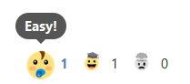

By default, the available reactions are "Easy!", "I'm getting better!" and "So hard...". These texts and their associated emoji are [customizable](#reactions-emoji).  
Only one vote per module is allowed for each user. Users can freely change their vote, or remove it (by clicking again the previously selected reaction).

#### Accessing reactions details

Teachers can access detailed information about reactions by clicking the link in the block content:  
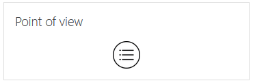

This leads to a table with information about votes for each user and each course module:  
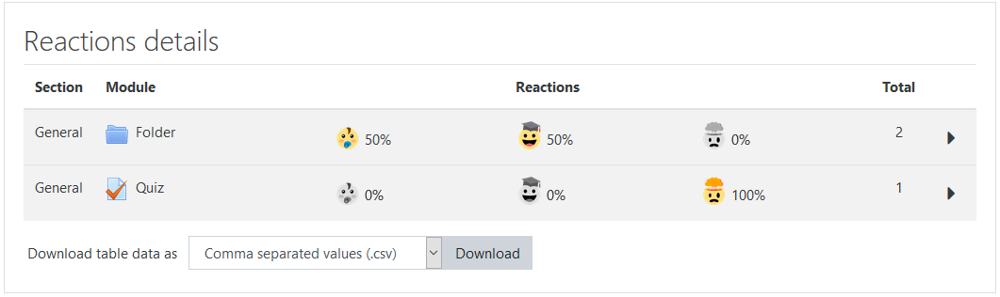

Information about reactions votes is displayed as percentages by default. This can be toggled to number of votes by clicking on the reactions:  
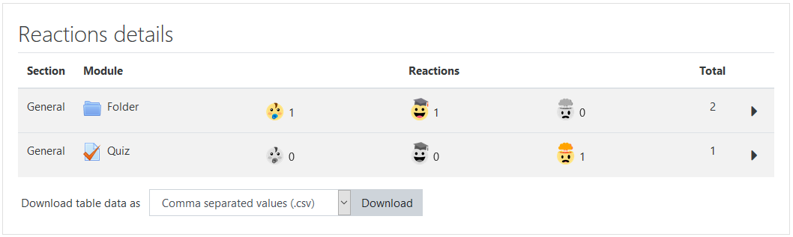

Clicking the arrow on the right of a row allows access to detailed information about each user's vote on the module:  
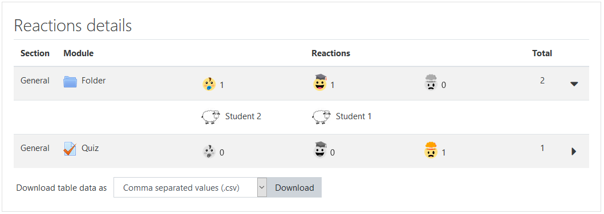

## Configuration

Once added to a course, the Point of View block needs to be configured.  

### Enabling reactions

To enable reactions in the course, the following option needs to be set to Yes:  
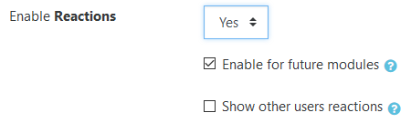  

Once enabled on block level, reactions can be enabled or disabled for each course module by checking the "Reactions" checkbox:  
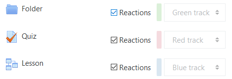  

Reactions can also be enabled or disabled for all course modules of one type:  
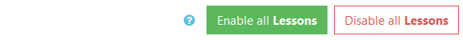  
...or for all course modules in a section:  
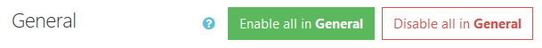  

### Enabling difficulty tracks

To enable difficulty tracks in the course, the following option needs to be set to Yes:  
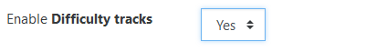  

Once enabled on block level, difficulty tracks can be set for each course module with a dropdown menu:
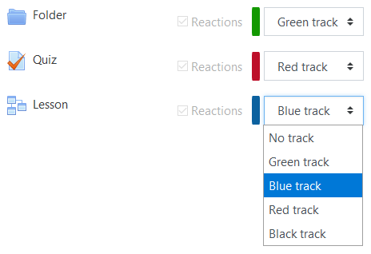

## Customization

### Reactions emoji

Custom emoji can be defined to be used as reactions pictures. This can be done either at the site level (in plugin administration settings), or at the block level (on the block configuration page).  
**Note:** Only **3** different reactions ("Easy", "I'm getting better" and "So hard" by default) are available.

Site administrators can define custom emoji to be used as reactions pictures site-wide:  
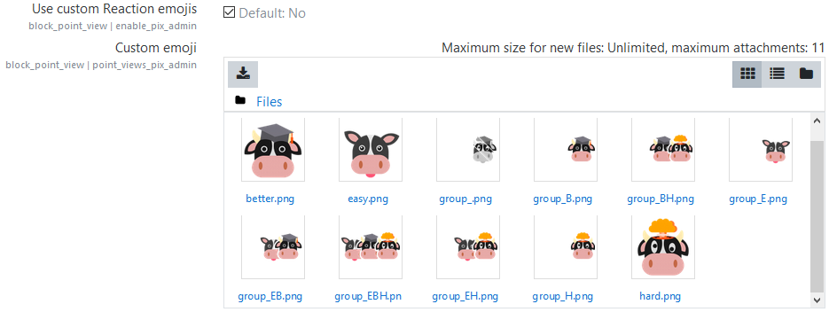  
11 files are needed: 3 emoji, 7 emoji groups (all possible groups from 1 to 3 emoji) and 1 neutral emoji meaning no vote on the activity. Please stick to the specified names.    
|                      | Emoji                                | Emoji group                               | No vote emoji group  |
| -------------------- |:------------------------------------:|:-----------------------------------------:|:--------------------:| 
| **File names**       | easy.png better.png hard.png | group\_E.png group\_B.png group\_H.png group\_EB.png group\_EH.png group\_BH.png group\_EBH.png | group\_.png           |
| **Preferred size**                | 200x200                              | 400x200                                                                                                          | 400x200              |
| **Extension**        | PNG                                  | PNG                                       | PNG                  |

At the block level, teachers can choose which emoji to use, as well as using their own custom emoji. The requirements are the same as above.  
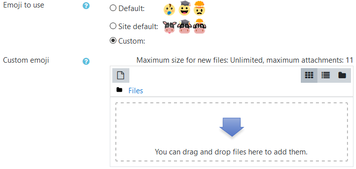  

At the block level, custom text to be used for reactions can also be defined.  
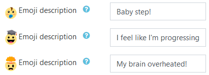

### Difficulty tracks colors

Site administrators can define custom difficulty tracks colors. This is useful if your site uses a theme where one of the default colors renders badly.  
**Note:** Only **4** difficulty tracks (Green, Blue, Red and Black by default) are available.  
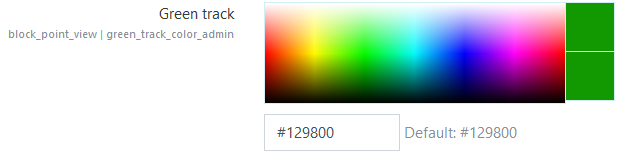
